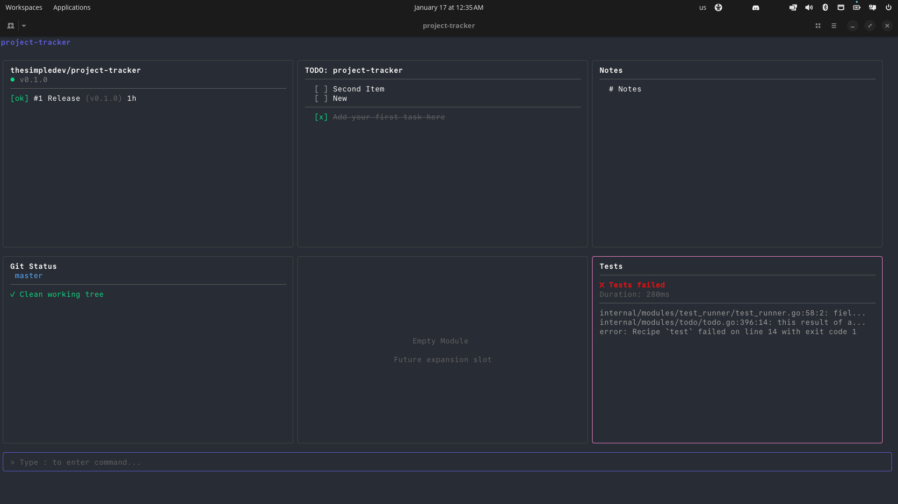

# Project Tracker

A modular terminal dashboard for tracking project status. Built with Go and [Bubble Tea](https://github.com/charmbracelet/bubbletea).



## Features

- **3x2 grid layout** with 6 module slots
- **Vim-style navigation** (hjkl, :commands)
- **Multiple modules**: CI Status, TODO, Notes, Git Status, Test Runner
- **Profile support**: Save and load different project layouts

## Installation

```bash
# Install via go install
go install github.com/thesimpledev/project-tracker/cmd/pt@latest

# Or build from source
git clone https://github.com/thesimpledev/project-tracker.git
cd project-tracker
go build -o pt ./cmd/pt
./pt
```

Then run with:
```bash
pt
```

### Requirements

- Go 1.21+
- [GitHub CLI](https://cli.github.com/) (`gh`) - for CI status module
- [just](https://github.com/casey/just) - for test runner module (optional)
- Clipboard tool for `yy` copy: `xclip`, `xsel`, or `wl-copy` (Linux) / `pbcopy` (macOS)

## Quick Start

1. Run `project-tracker`
2. Press `:` to enter command mode
3. Type `:add /path/to/your/repo` and press Tab to autocomplete
4. Press Enter on a git repository to add it

## Navigation

| Key | Action |
|-----|--------|
| `h` `j` `k` `l` | Move between modules (vim-style) |
| `Arrow keys` | Move between modules |
| `Enter` | Focus selected module |
| `Esc` | Unfocus module / cancel command |
| `:` | Enter command mode |
| `t` | Run tests (global hotkey) |
| `yy` | Copy module content to clipboard |
| `q` | Quit (when not in command mode) |
| `Ctrl+C` | Force quit |

## Commands

Press `:` to enter command mode, then type a command:

| Command | Description |
|---------|-------------|
| `:change <path>` | Change to a different project |
| `:c <path>` | Short for `:change` |
| `:q` or `:quit` | Quit |

**Tab completion** is available for paths. Paths marked `[repo]` are git repositories.

---

## Modules

### CI Status (Top Left)

Shows GitHub Actions workflow runs for the repository.

**When focused:**

| Key | Action |
|-----|--------|
| `j` / `k` | Navigate workflow runs |
| `Enter` | View run details and jobs |
| `Esc` | Go back / unfocus |

**Display:**
- Repository name and branch
- Overall CI status indicator (green/red/yellow)
- List of recent workflow runs with status

---

### TODO (Top Middle)

Manages a `TODO.md` file in the project root. Creates the file automatically if it doesn't exist.

**When focused:**

| Key | Action |
|-----|--------|
| `j` / `k` | Navigate items |
| `Space` | Toggle check/uncheck |
| `a` | Add new item |
| `d` or `x` | Delete selected item |
| `Shift+J` | Move item down |
| `Shift+K` | Move item up |
| `Esc` | Unfocus |

**When adding (after pressing `a`):**

| Key | Action |
|-----|--------|
| Type | Enter task text |
| `Enter` | Save new item |
| `Esc` | Cancel |

**Display:**
- Unchecked items at top
- Horizontal divider
- Checked items below (crossed out)

**File format** (`TODO.md`):
```markdown
# TODO

- [ ] Unchecked task
- [x] Completed task
```

---

### Notes (Top Right)

Free-form notes stored in `NOTES.md`. Auto-saves on changes.

**When focused:**

| Key | Action |
|-----|--------|
| `j` / `k` | Navigate lines |
| `i` or `Enter` | Edit current line |
| `a` | Add new line after cursor |
| `o` | Open new line below |
| `O` | Open new line above |
| `d` or `x` | Delete current line |
| `Esc` | Unfocus |

**When editing:**

| Key | Action |
|-----|--------|
| Type | Enter text |
| `Enter` | Save line and create new line below |
| `Backspace` | Delete character (or merge with previous line) |
| `Esc` | Save and exit edit mode |

**File format** (`NOTES.md`):
```markdown
# Notes

Your notes here...
Line by line editing.
```

---

### Git Status (Bottom Left)

Shows the current branch and file changes. Updates automatically every 3 seconds.

**When focused:**

| Key | Action |
|-----|--------|
| `j` / `k` | Navigate changed files |
| `r` | Manual refresh |
| `Esc` | Unfocus |

**Display:**
- Current branch name
- Summary: staged, modified, untracked counts
- List of changed files with status indicators:
  - `M` (yellow) - Modified
  - `A` (green) - Added/Staged
  - `D` (red) - Deleted
  - `?` (gray) - Untracked

---

### Test Runner (Bottom Right)

Runs tests via `just test` and displays a summary. Automatically creates a `justfile` with a test command if one doesn't exist.

**Global hotkey:** Press `t` anywhere in the dashboard to run tests.

**When focused:**

| Key | Action |
|-----|--------|
| `t` or `Enter` | Run tests |
| `j` / `k` | Navigate failed tests |
| `Enter` | View failure details (when on a failed test) |
| `Esc` | Unfocus |

**In detail view (viewing failure output):**

| Key | Action |
|-----|--------|
| `j` / `k` | Scroll through output |
| `t` | Rerun tests |
| `Esc` | Go back to summary |

**Display:**
- Status: idle, running, passed, or failed
- Pass/fail counts
- Duration
- List of failed test names (if any)
- Detailed failure output when viewing a specific test

**Justfile:**
If no `justfile` exists, one is created with:
```just
# Run tests
test:
    go test ./...
```

If a `justfile` exists but has no `test:` command, the test command is appended.

---

## Grid Layout

```
┌─────────────┬─────────────┬─────────────┐
│  CI Status  │    TODO     │    Notes    │
├─────────────┼─────────────┼─────────────┤
│ Git Status  │ (available) │    Tests    │
└─────────────┴─────────────┴─────────────┘
```

---

## Configuration

Config is stored at `~/.config/project-tracker/config.json`

Profiles are stored at `~/.config/project-tracker/profiles/`

---

## License

MIT
